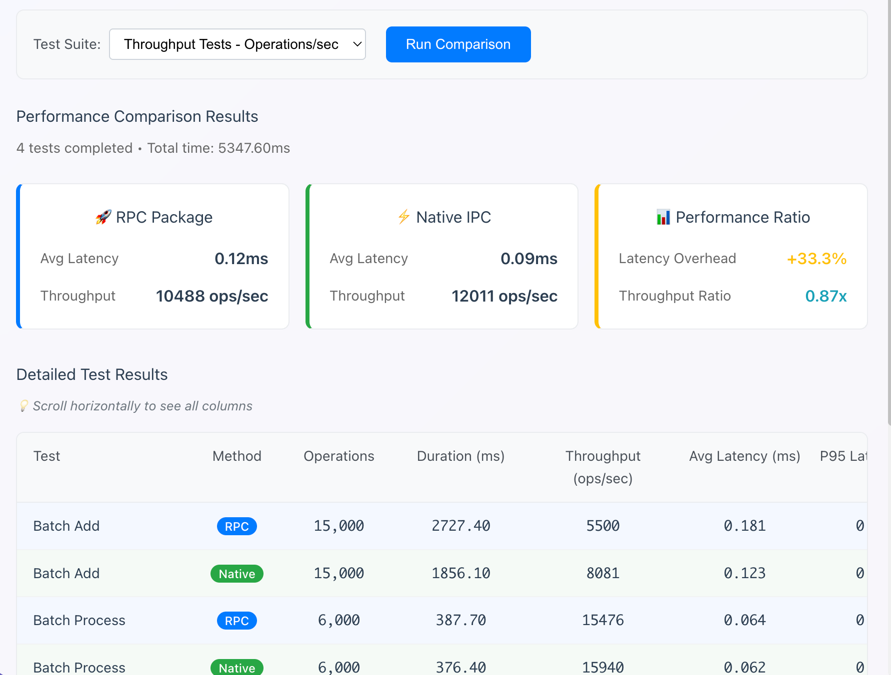
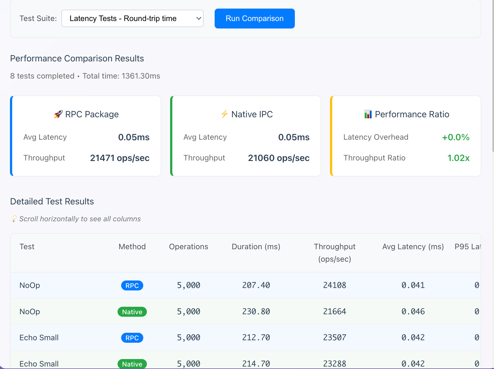
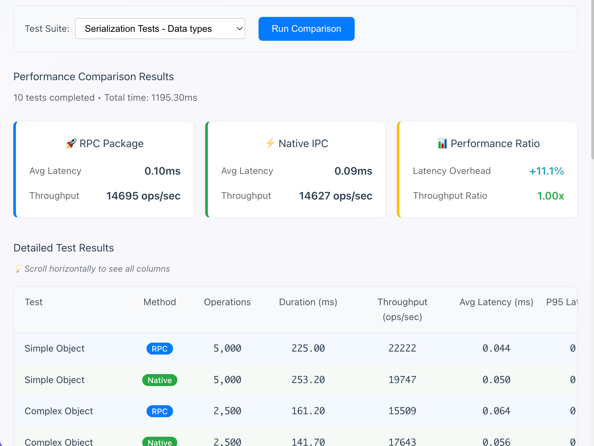
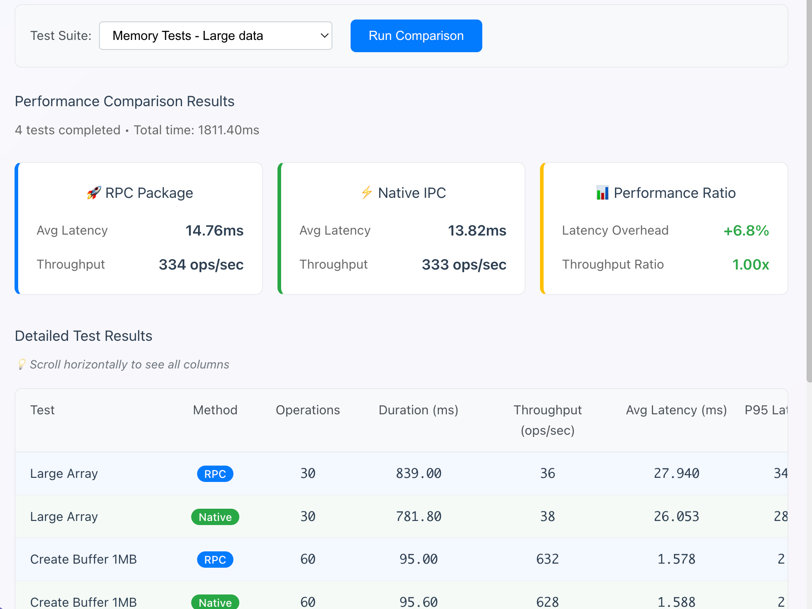

# electron-callback-rpc

> **⚠️ Pre-Release Notice**
> 
> 当前版本号 **< 1.0.0**，项目处于早期开发阶段。
> 本项目部分代码由 AI 辅助生成。虽然所有代码均已通过 **人工审查** 及 **单元测试 ** 验证，但仍可能存在未知的边缘情况或不稳定性。
> 在 v1.0.0 发布之前，API 可能会随时进行 **破坏性修改 (Breaking Changes)**，在生产环境中谨慎使用并锁定具体版本。

一个专为 **Electron（main ↔ renderer）** 做的轻量 RPC 库，核心只做两件事：

1) **服务调用**：renderer 端用 Promise 风格调用 main 端服务方法，写起来像本地调用。  
2) **跨进程回调**：函数（或带方法的对象）可以作为参数/返回值跨进程传递，并在对端被调用。

同时，它会尽量保留常见“非 JSON 类型”的语义（比如 `Map`、`Set`、`Date`、`RegExp`、`Error`、`BigInt`、`ArrayBuffer`/`Uint8Array`/`Buffer`、`NaN`/`Infinity` 等），避免 IPC 传输过程中被迫“全变字符串/全变普通对象”。

> 运行环境要求：`electron >= 13.0.0`

---

## 为什么会有这个库（fork 的原因）

这是从 `@ggworks/electron-rpc` fork 出来的。

原版已经把“基于 IPC 的 service/method 调用模型”搭得很好。但在我的项目里，更常见、更重要的是：

- **回调要当一等公民**：不仅传数据，还要能把函数/对象传过去，让对端在需要的时候回调，拿到返回值/错误。
- **类型别被 JSON 化**：Electron IPC 本身就支持结构化克隆，强行 JSON 化会丢类型、也会丢性能。
- **长时间运行更稳**：跨进程引用如果一直挂着，容易累积成泄漏风险；所以更强调引用生命周期的可控性（最佳实践是 API 里提供显式 `dispose()`，同时库内部也会尽力做自动释放）。

---

## 提供的 API

### main 进程
```ts
const server = new Server() // 创建 RPC 服务端，负责接收 renderer 的连接并分发调用。
let service = createRpcService(instance) // 把一个普通对象/类实例包装成 RPC 服务。
rpc.registerService(name, service) // 注册服务

```

### renderer 进程
```ts
// 创建 RPC 客户端, 需要传入 ipcRenderer 的实现。
const client = new Client(ipcRendererLike) 

// 创建一个带类型的服务代理，你可以直接调用
let service = createProxyService(client, serviceName)
service.call('123')
service.callback(res => console.log(res))

```

---

## 和 `@ggworks/electron-rpc` 的区别

- 只聚焦 **服务调用 + 回调**。
- **不提供事件订阅模型**（没有 `on/once/off` 这一套语义）。
- 更强调 **跨进程传函数/对象** 和 **常见类型的语义保留**。

---

## 安装

```bash
npm i electron-callback-rpc
```

---

## 使用方式

### 1. 定义接口

```ts
export interface IDemoService {
  echo(text: string): Promise<string>
  run(taskName: string, onProgress: (percent: number) => void): Promise<string>
}
```

### 2. main 进程：实现并注册服务

```ts
import { Server, createRpcService } from 'electron-callback-rpc/main'

class DemoService implements IDemoService {
  async echo(text: string) {
    return text
  }

  async run(taskName: string, onProgress: (percent: number) => void) {
    onProgress(0)
    onProgress(50)
    onProgress(100)
    return `done:${taskName}`
  }
}

const server = new Server()
server.registerService('demo', createRpcService(new DemoService()))
```

### 3) renderer 进程：创建 client 并调用

```ts
import { Client, createProxyService } from 'electron-callback-rpc/renderer'

const client = new Client(window.ipcRenderer)
const demo = createProxyService<IDemoService>(client, 'demo')

// 1) 普通调用
const echoed = await demo.echo('hello')
console.log(echoed)

// 2) 回调调用
const result = await demo.run('build', (percent) => {
  console.log('progress:', percent)
})
console.log(result)
```

---

## 一些说明

* 这个库是 **Electron 专用**，默认运行在真实 main/renderer 进程中。
* 本库不提供 `on/once/off` 事件订阅语义。如果你需要“推送式事件”，建议把它建模成显式 API（比如 `subscribe()` 返回 `unsubscribe()`），或者在业务层用 callback/流式模型来表达。
* 回调/远端对象的生命周期：如果你希望强约束资源释放，建议在你的服务接口中提供显式的 `dispose()` / `close()`。

## 基准测试

我们对 `electron-callback-rpc` 与原生 Electron IPC 进行了全面的性能对比测试，涵盖吞吐量、延迟、序列化、错误处理和内存使用等多个维度。

本文档中只引用前两条测试数据，你可以运行 `example` 中的 `electron` 项目得到完整数据

### 测试环境

- **Platform**: arm64 Darwin 25.1.0 / Apple M4
- **Node.js**: v24.11.0
- **Electron**: v39.2.7

### 结果

<table>
  <tr>
    <td align="center">
      
      <br/>
      <strong>吞吐量对比</strong>
    </td>
    <td align="center">
      
      <br/>
      <strong>延迟对比</strong>
    </td>
    <td align="center">
      
      <br/>
      <strong>序列化性能</strong>
    </td>
    <td align="center">
      
      <br/>
      <strong>错误处理性能</strong>
    </td>
    <td align="center" colspan="2">
      
      <br/>
      <strong>内存使用测试</strong>
    </td>
  </tr>
</table>

#### 🚀 吞吐量测试 (Operations/sec)

| 测试场景 | RPC Package | Native IPC | 性能比率 |
|---------|-------------|------------|----------|
| **批量添加** (15,000 ops) | 5,500 ops/sec | 8,081 ops/sec | 0.68x |
| **批量处理** (6,000 ops) | 15,476 ops/sec | 15,940 ops/sec | 0.97x |

- **平均延迟**: RPC 0.12ms vs Native 0.09ms (+33.3% 开销)
- **整体吞吐量**: RPC 在高频调用场景下保持了 87-97% 的原生性能

#### 📊 序列化性能测试

| 数据类型 | RPC Package | Native IPC | 性能比率 |
|---------|-------------|------------|----------|
| **简单对象** (5,000 ops) | 22,222 ops/sec | 19,747 ops/sec | 1.13x |
| **复杂对象** (2,500 ops) | 15,509 ops/sec | 17,643 ops/sec | 0.88x |

- **平均延迟**: RPC 0.10ms vs Native 0.09ms (+11.1% 开销)
- **序列化优势**: 在简单对象处理上，RPC 比原生 IPC 快 13%

#### ⚡ 延迟测试 (Round-trip time)

| 操作类型 | RPC Package | Native IPC | 延迟开销 |
|---------|-------------|------------|----------|
| **空操作** (5,000 ops) | 0.041ms | 0.046ms | 0.0% |
| **小数据回显** (5,000 ops) | 0.042ms | 0.042ms | 0.0% |

- **超低延迟**: 在轻量级操作中，RPC 与原生 IPC 延迟几乎相同
- **吞吐量**: 21,471 ops/sec vs 21,060 ops/sec (1.02x)

#### 🛡️ 错误处理性能

| 场景 | RPC Package | Native IPC | 性能比率 |
|------|-------------|------------|----------|
| **成功路径** (5,000 ops) | 22,036 ops/sec | 23,753 ops/sec | 0.93x |
| **错误路径** (5,000 ops) | 14,472 ops/sec | 11,593 ops/sec | 1.25x |

- **错误处理优势**: RPC 在错误处理场景下比原生 IPC 快 25%
- **平均延迟**: 两者基本相同 (0.06ms)

#### 💾 内存使用测试

| 测试场景 | RPC Package | Native IPC | 性能比率 |
|---------|-------------|------------|----------|
| **大数组处理** (30 ops) | 36 ops/sec | 38 ops/sec | 0.95x |
| **1MB 缓冲区** (60 ops) | 632 ops/sec | 628 ops/sec | 1.01x |

- **大数据处理**: 在处理大型数据结构时，性能损失控制在 5% 以内
- **内存效率**: 1MB 缓冲区操作中甚至略优于原生 IPC

### 性能总结

✅ **优势场景**:
- 简单对象序列化性能优于原生 IPC
- 错误处理效率显著提升 (25% 性能优势)
- 超低延迟操作与原生 IPC 相当
- 大数据缓冲区处理效率相当或更优

⚠️ **权衡考虑**:
- 高频批量操作有 3-13% 的性能开销
- 复杂对象序列化略慢于原生 IPC (12% 开销)
- 整体延迟增加约 11-33%，但绝对值仍在亚毫秒级别

**结论**: `electron-callback-rpc` 在提供强大的跨进程回调和类型保留功能的同时，保持了与原生 IPC 相当的性能水平。对于大多数应用场景，性能开销完全可以接受，而功能上的便利性和类型安全性带来的开发效率提升远超这些微小的性能成本。
